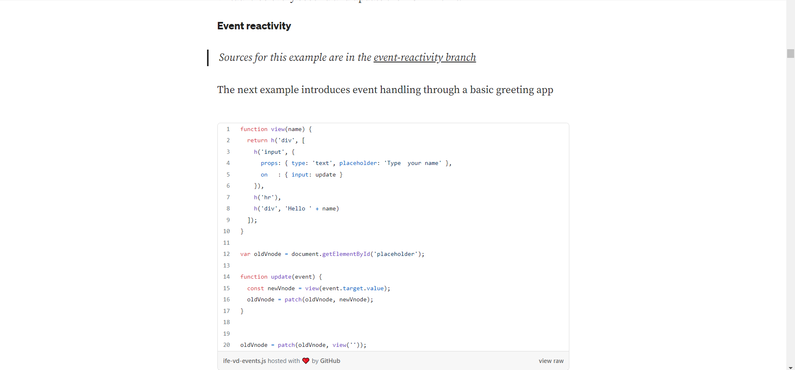
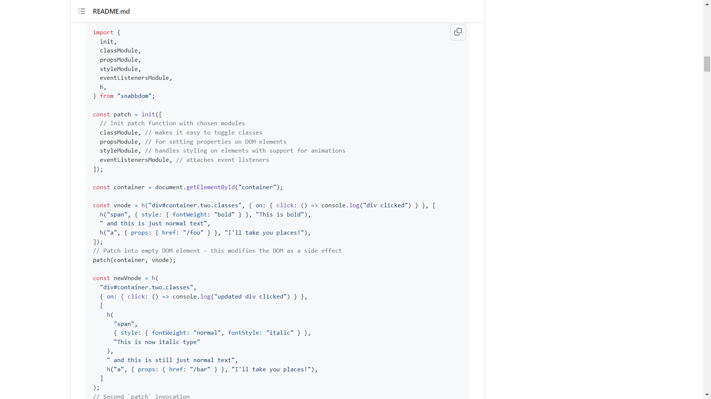

## To Run and Execute
#### To Run the file Navigate to Lerna/packages/snabbdom
## in cmd line type
#### `live-server`

### To Run the file after changes in app.js make sure to compile it using webpack
## in cmd line type
### `webpack`

##### the dist file is used in html

## Refered URL to create Snabbdom Application

 (Refer Link 1)[https://medium.com/@yelouafi/react-less-virtual-dom-with-snabbdom-functions-everywhere-53b672cb2fe3]

 (Refer Link 2)[https://github.com/snabbdom/snabbdom]

